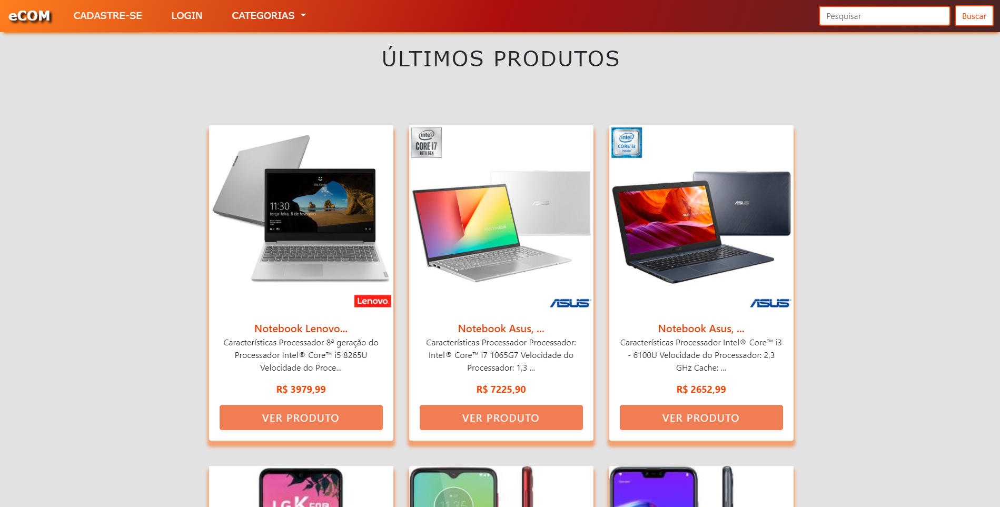
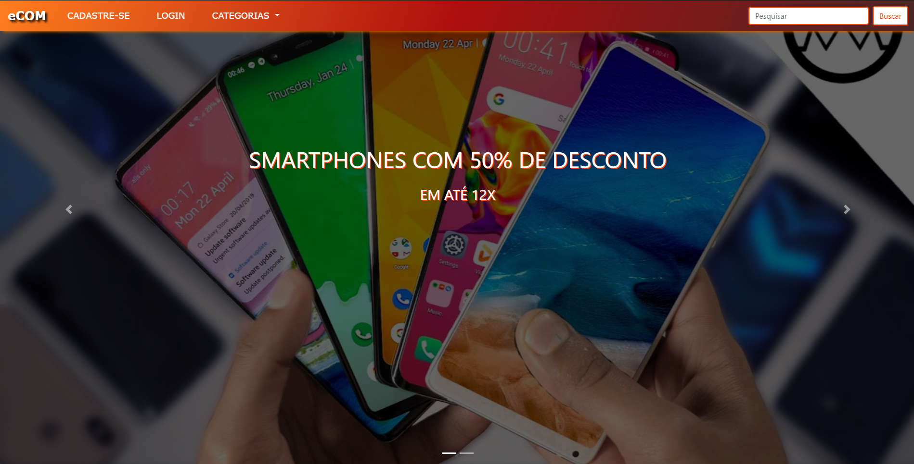
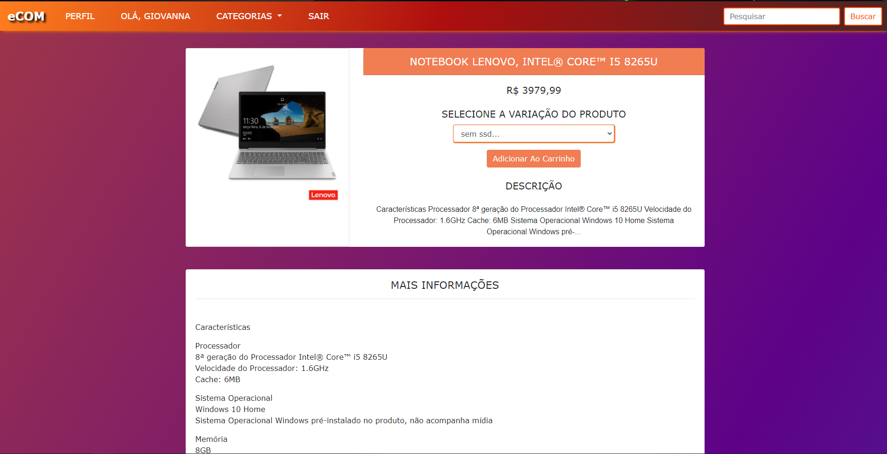
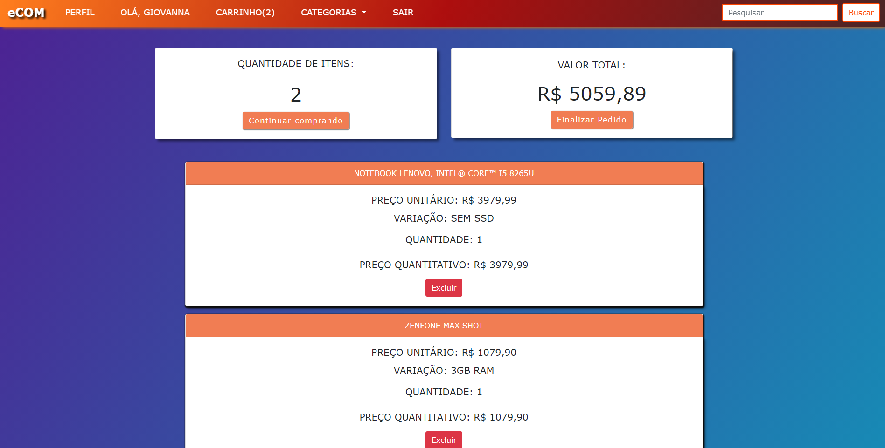
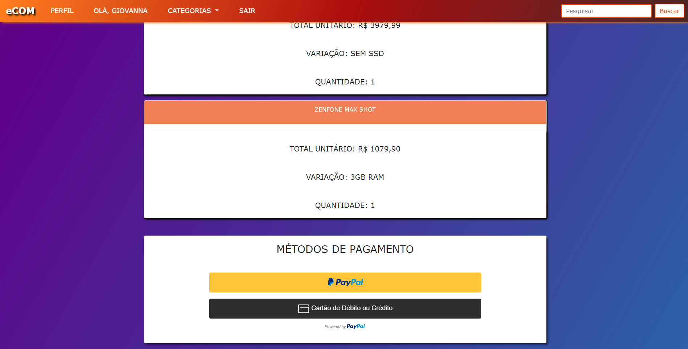
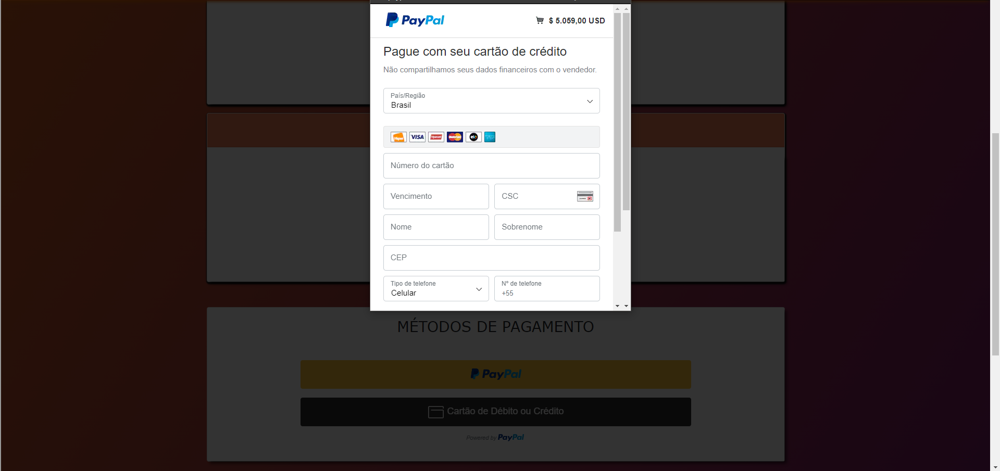

# Ecommerce with Paypal payment method

## See preview here: https://ecom-store-electronics.herokuapp.com/
---














---

### Table of Contents
Find yourself here

- [Description](#description)
- [Features](#Features)
- [How To Use](#how-to-use)
- [License](#license)
- [Author Info](#author-info)


---

## Description
This is an electronic commerce of electronic products, including product variations, categories, administrative area, user profile to track orders and payment method with the digital account paypal or credit card such as Visa, Mastercard, Elo, American Express.

## Technologies

### Database
- PostgreSQL
### Backend
- Python
- Django framework(class-based-views, function-based-views)
### Frontend
- HTML5
- CSS3
- Javascript
- Bootstrap4


---
## Features

### Administrative area:
- Authorization for a user or groups of users
- Registration of products including their respective variations in characteristics or price
- Create, delete, view or update users, products, orders or order items. You can define which of these features a group of users can access

### User Profile
- when a user completes the registration, they are redirected to the profile where they can add address information, change password, view order status or change personal information.

### User Login
- To login, use your username and password. If the user does not remember the password, he can use "I forgot the password" to reset it.

### Forgot password
- If the user forgets the password, they can enter their e-mail address to receive instructions on how to change the password.

### CPF(SSN in USA)
- The CPF is validated, that is, if you want to perform a test you need to use a CPF generator to complete the registration

### Product Details
- When selecting a product variation the price will change dynamically if there is a price variation

### Cart
- The cart will keep your products stored for up to 7 days using backend sessions, if the desired product does not have enough stock, the user will be notified before finalizing the payment.

### Checkout

- After completing the order the user must confirm his personal information and address, if he does not have a registered address it will not be possible to complete the purchase

### Payment

- Payment can be made through a digital Paypal account or by credit card such as Visa, Mastercard, Elo, American Express and many others.

- Integration with Paypal API
---

## How To Use

### Run locally
#### Use at least python 3.7.1 version
### Clone the project

```html
git clone https://github.com/GiovannaK/ecommerce-paypal-payment-method.git
```
### Create and start a virtual environment

#### Windows
```html
python -m venv venv

venv\Scripts\activate.bat

python -m pip install --upgrade pip setuptools wheel --user

pip install -r requirements.txt

python manage.py migrate
```

#### Linux

```html
python3.7 -m venv venv

. venv/bin/activate

pip install -r requirements.txt

python manage.py migrate
```

#### MAC

```html
python -m venv venv

. venv/bin/activate

pip install -r requirements.txt

python manage.py migrate
```

### Database

#### Create a postgres database and add the credentials to settings.py

```html
DATABASES = {
    'default': {
        'ENGINE': 'django.db.backends.postgresql_psycopg2',
        'NAME': 'db_name',
        'USER': 'name',
        'PASSWORD': '',
        'HOST': 'localhost',
        'PORT': '',
    }
}
```
### S3 bucket was used to store static files and images you can create an account in AWS, create a bucket and setup the credentials in settings.py

```html
AWS_ACCESS_KEY_ID = config('AWS_ACCESS_KEY_ID')
AWS_SECRET_ACCESS_KEY = config('AWS_SECRET_ACCESS_KEY')
AWS_STORAGE_BUCKET_NAME = config('AWS_STORAGE_BUCKET_NAME')
AWS_S3_FILE_OVERWRITE = False
AWS_DEFAULT_ACL = None
DEFAULT_FILE_STORAGE = 'storages.backends.s3boto3.S3Boto3Storage'
STATICFILES_STORAGE = 'storages.backends.s3boto3.S3Boto3Storage'

STATIC_URL = 'http://' + AWS_STORAGE_BUCKET_NAME + '.s3.amazonaws.com/'
ADMIN_MEDIA_PREFIX = STATIC_URL + 'admin/'
```
### If you don't want to use the S3 bucket, delete the credentials, remove ADMIN_MEDIA_PREFIX and change STATIC_URL to 

```html
STATIC_URL = '/static/'
```
### Generate a secret key and add to settings.py
---
### You can use this link to generate your secret key
#### https://miniwebtool.com/django-secret-key-generator/
---
### Run this command to migrate your database

```html
python manage.py migrate
```
### Run this to create an admin account

```html
python manage.py createsuperuser
```
### Start the development server in localhost:8000

```html
python manage.py runserver
```


---


## License

MIT License

Copyright (c) [2020]

Permission is hereby granted, free of charge, to any person obtaining a copy
of this software and associated documentation files (the "Software"), to deal
in the Software without restriction, including without limitation the rights
to use, copy, modify, merge, publish, distribute, sublicense, and/or sell
copies of the Software, and to permit persons to whom the Software is
furnished to do so, subject to the following conditions:

The above copyright notice and this permission notice shall be included in all
copies or substantial portions of the Software.

THE SOFTWARE IS PROVIDED "AS IS", WITHOUT WARRANTY OF ANY KIND, EXPRESS OR
IMPLIED, INCLUDING BUT NOT LIMITED TO THE WARRANTIES OF MERCHANTABILITY,
FITNESS FOR A PARTICULAR PURPOSE AND NONINFRINGEMENT. IN NO EVENT SHALL THE
AUTHORS OR COPYRIGHT HOLDERS BE LIABLE FOR ANY CLAIM, DAMAGES OR OTHER
LIABILITY, WHETHER IN AN ACTION OF CONTRACT, TORT OR OTHERWISE, ARISING FROM,
OUT OF OR IN CONNECTION WITH THE SOFTWARE OR THE USE OR OTHER DEALINGS IN THE
SOFTWARE.


---

## Author Info

- Linkedin - [Giovanna Cunha](https://www.linkedin.com/in/giovanna-cunha-4989b81b2/)


